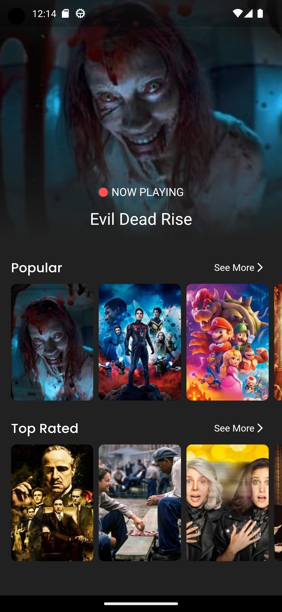
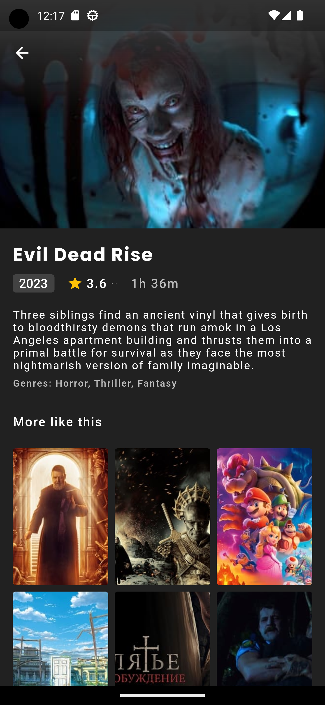

# Movie App

## Changelog

- New UI design added.
- Added Animation.
- app integrated with deep links.
- removed useless login/signUp.
- Added local database.

## App Information

Here,i created this app with [The Movie Database api](https://www.themoviedb.org/settings/api) 

**Packages used:**

  animate_do: ^3.0.2
  cached_network_image: ^3.2.3
  carousel_slider: ^4.2.1
  dartz: ^0.10.1
  dio: ^5.1.2
  equatable: ^2.0.5
  flutter_bloc: ^8.1.2
  get_it: ^7.6.0
  google_fonts: ^4.0.4
  shimmer: ^2.0.0

